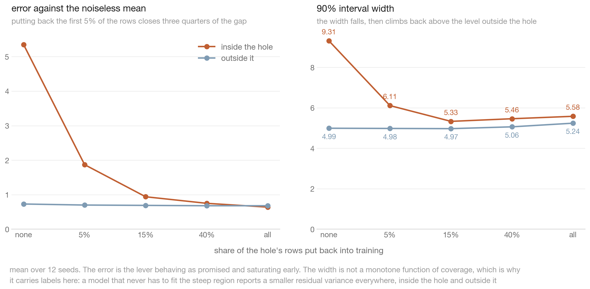
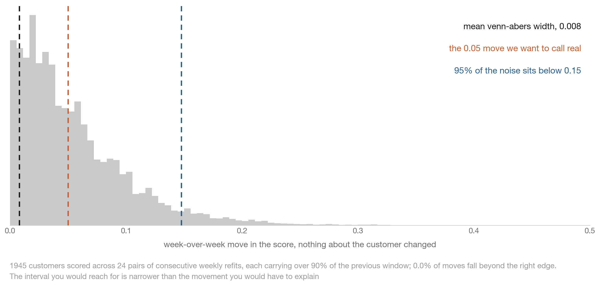
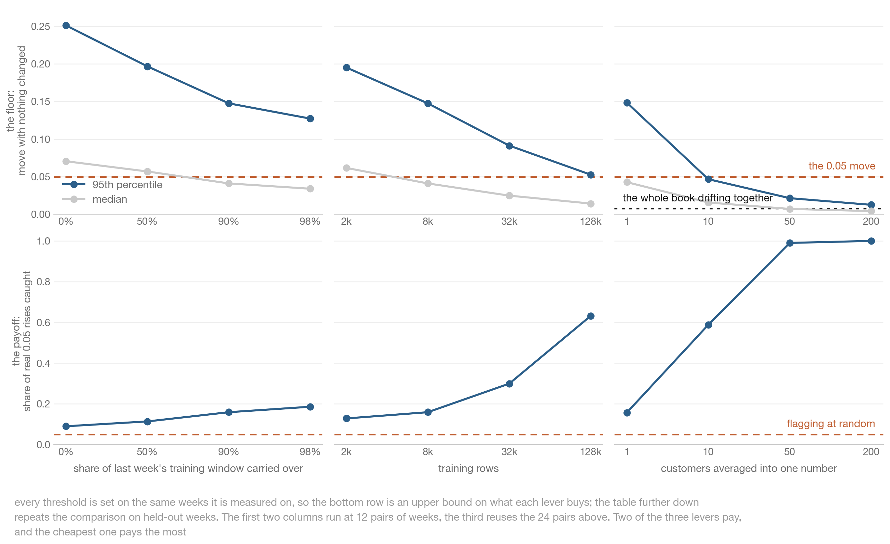
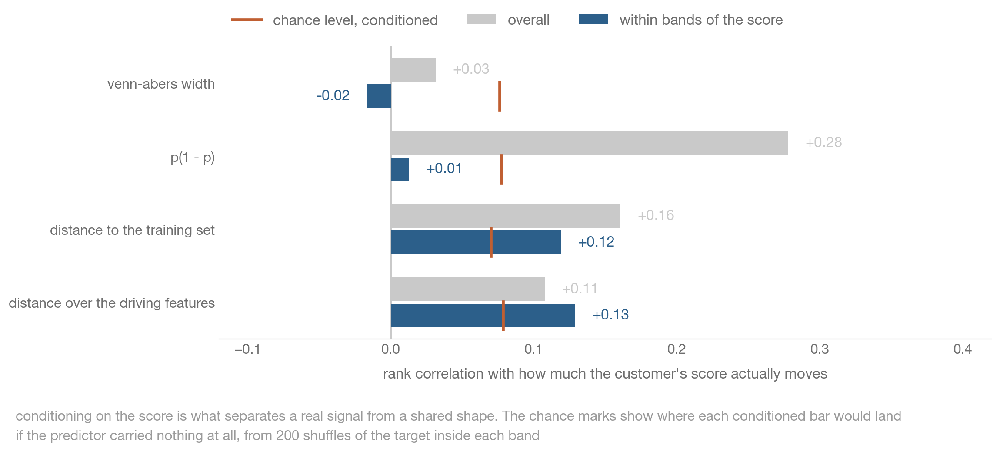
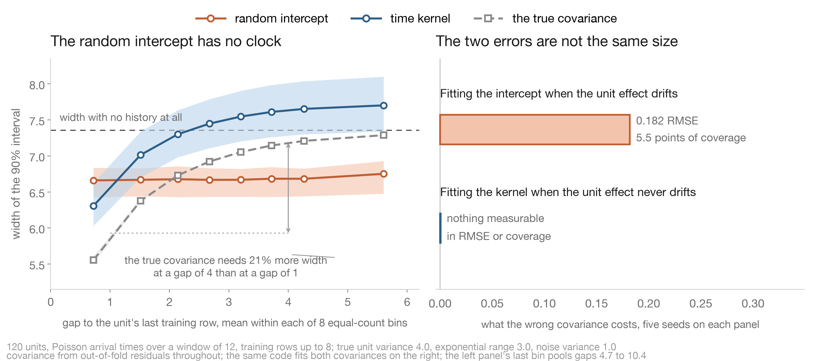
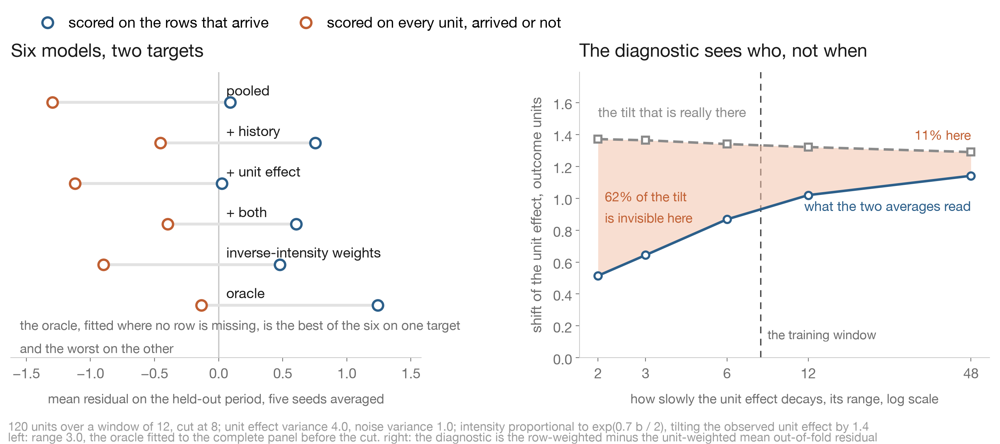
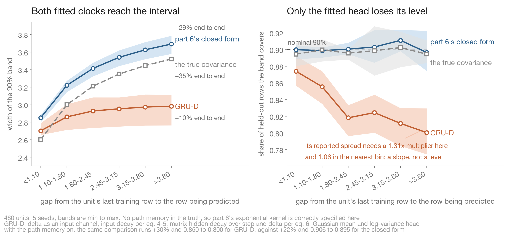
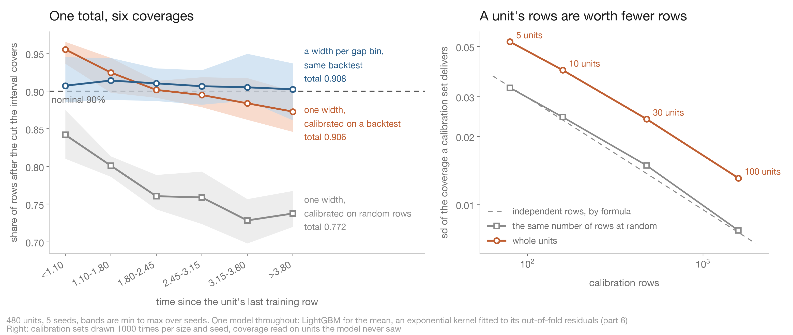

# demo-notebooks

Self-contained notebooks backing posts and articles. One notebook per topic, each pulling its data
from public URLs and runnable end to end in Colab.

| Notebook | Topic | Colab |
|---|---|---|
| [catboost_rmsewithuncertainty_conformal](notebooks/catboost_rmsewithuncertainty_conformal.ipynb) | Turning the CatBoost `RMSEWithUncertainty` sigma into a calibrated 90% interval, and which held-out diagnostic predicts a lopsided one | [open](https://colab.research.google.com/github/firefly1248/demo-notebooks/blob/main/notebooks/catboost_rmsewithuncertainty_conformal.ipynb) |
| [catboost_sglb_knowledge_uncertainty](notebooks/catboost_sglb_knowledge_uncertainty.ipynb) | Checking CatBoost's SGLB knowledge uncertainty against the actual error on a known function | [open](https://colab.research.google.com/github/firefly1248/demo-notebooks/blob/main/notebooks/catboost_sglb_knowledge_uncertainty.ipynb) |
| [panel_merf_gpboost_variance](notebooks/panel_merf_gpboost_variance.ipynb) | Where MERF and GPBoost get their noise variance from, and what their 90% interval actually covers | [open](https://colab.research.google.com/github/firefly1248/demo-notebooks/blob/main/notebooks/panel_merf_gpboost_variance.ipynb) |
| [catboost_quantile_multiquantile_cqr](notebooks/catboost_quantile_multiquantile_cqr.ipynb) | What a CatBoost quantile band actually covers, when `MultiQuantile` is enough and when it needs conformalizing | [open](https://colab.research.google.com/github/firefly1248/demo-notebooks/blob/main/notebooks/catboost_quantile_multiquantile_cqr.ipynb) |
| [uncertainty_attribution_shap](notebooks/uncertainty_attribution_shap.ipynb) | Whether attributing a prediction interval's width with SHAP recovers the features that actually drive the uncertainty | [open](https://colab.research.google.com/github/firefly1248/demo-notebooks/blob/main/notebooks/uncertainty_attribution_shap.ipynb) |
| [panel_pymc_hierarchical](notebooks/panel_pymc_hierarchical.ipynb) | Where a hierarchical Bayesian model gets its noise scale from, and why 90% coverage does not settle it | [open](https://colab.research.google.com/github/firefly1248/demo-notebooks/blob/main/notebooks/panel_pymc_hierarchical.ipynb) |
| [score_sensitivity_venn_abers](notebooks/score_sensitivity_venn_abers.ipynb) | How large a week-over-week move in a propensity score has to be before it means anything, and whether a Venn-Abers interval tells you | [open](https://colab.research.google.com/github/firefly1248/demo-notebooks/blob/main/notebooks/score_sensitivity_venn_abers.ipynb) |
| [panel_irregular_kernel](notebooks/panel_irregular_kernel.ipynb) | Which random effect an irregular panel needs, what each route to it costs, and why the interval needs a horizon term | [open](https://colab.research.google.com/github/firefly1248/demo-notebooks/blob/main/notebooks/panel_irregular_kernel.ipynb) |
| [panel_informative_arrival](notebooks/panel_informative_arrival.ipynb) | What an arrival process that depends on the outcome costs a predictive model, which deployment target it costs it on, and how to measure that with two averages | [open](https://colab.research.google.com/github/firefly1248/demo-notebooks/blob/main/notebooks/panel_informative_arrival.ipynb) |
| [panel_sequence_models](notebooks/panel_sequence_models.ipynb) | That the decay sequence models use for irregular observation times is part 6's kernel, and that a Gaussian head on it widens with the gap but loses its nominal coverage as the gap grows | [open](https://colab.research.google.com/github/firefly1248/demo-notebooks/blob/main/notebooks/panel_sequence_models.ipynb) |
| [panel_coverage_by_gap](notebooks/panel_coverage_by_gap.ipynb) | Why one coverage number hides where a panel interval fails, and which calibration rows make split conformal hold | [open](https://colab.research.google.com/github/firefly1248/demo-notebooks/blob/main/notebooks/panel_coverage_by_gap.ipynb) |

## catboost_rmsewithuncertainty_conformal

Builds a 90% interval from the `RMSEWithUncertainty` head three ways (raw, sigma-normalized
conformal, CQR at nominal 5/95 and 10/90) on one synthetic and two public datasets, measuring
coverage, width and where the misses land.

It also tests which held-out diagnostic predicts a lopsided interval. Skewness of the normalized
residuals does not: on diamonds it ranges 0.38 to 5.58 across four hyperparameter settings while
the miss imbalance stays between 0.4 and 0.8 points. Bowley skew and the ratio of the 5th and 95th
percentiles do.

About five minutes on a free Colab CPU.

## catboost_sglb_knowledge_uncertainty

`posterior_sampling=True` plus `virtual_ensembles_predict` reports knowledge uncertainty from a
single model. This notebook measures that signal against the truth: the data comes from a known and
bounded 2D function, so every test point has both a reported uncertainty and a real error, and no
region is intrinsically harder to predict than another.

Both uncertainty columns are variances, so the notebook square-roots them before comparing them
with an error in the units of the target. In a gap cut out of the training data the model is 8.2x
more wrong than on covered data while the reported uncertainty is 1.1x. Past the edge of the range
the error is 20x, the signal is one constant across all 800 test points, and the total uncertainty
comes to 0.66x, below the covered level on all ten runs. A nearest-neighbour distance to the
training set ranks the error at 0.78 against 0.00 for knowledge uncertainty.

About a minute on a free Colab CPU.

## panel_merf_gpboost_variance

MERF and GPBoost both fit a nonlinear fixed part with trees and a random intercept per unit, and
both return a variance decomposition. Both also estimate the noise variance from residuals on rows
the fixed part was trained on, so the number tracks how hard the trees are fitted. On a synthetic
panel where the group variance and the noise variance are both 1.0, the group variance comes back
at 0.92 while the noise variance reads 0.58 for GPBoost at the setting a validation split picks,
and 0.71, 0.38 and 0.054 for MERF at 50, 100 and 400 base learner trees.

GPBoost's own 90% interval inherits that, covering 73% of held-out rows on seen units. Across the
20 settings in the tuning grid its coverage runs from 7% to 87%, and the 87% comes from underfitted
settings that the validation split rejects. Algorithm 2 of Sigrist (2022), which estimates the covariance parameters
from held-out residuals, brings coverage to 90% at the same accuracy.

About half an hour on a laptop CPU.

## catboost_quantile_multiquantile_cqr

The same 90% band built three ways — two separate `Quantile` models, `MultiQuantile` on the outer
pair, and `MultiQuantile` on ten levels — across the three datasets from the conformalized quantile
regression paper, at three hyperparameter settings and eight seeds.

None of the 27 seed-averaged raw bands reached the level it claimed; they run from 55.6% to 89.8%.
How hard the trees are fitted lowers coverage on every arm, and the ten-level arm falls furthest:
on concrete at the hardest setting the gap between arms is wider than the gap between settings.
Conformalizing centres every dataset on 90% and holds there across a training sweep where the raw
band climbs from 61% at a 500-row pool to 86% at 36,584.

Asking one model for ten levels ran about 3x faster than fitting ten and crossed far less often, on
4% to 74% of rows against 24% to 97%. It is still not the best answer to crossing: sorting each row
of predictions removes crossings outright and lands the individual levels closer than the joint
model as fitted in all nine settings, and closer than the joint model sorted too in eight. A
synthetic case separates where the shared structure shows from where it costs: at the light setting
the arms are within 0.001 of each other on pinball loss, and only once the fit is hard does sharing
cost, about 2% for the pair and 7% for ten levels.

About fifteen minutes on a laptop CPU.

## panel_pymc_hierarchical

The panel from `panel_merf_gpboost_variance`, with the same known scales, fitted as a hierarchical
Bayesian model instead. The posterior predictive integrates over the parameters, so its interval
carries the error of the fitted mean, which is the term the tree methods there had no room for.

Both PyMC models cover 90.0% of held-out rows on seen units against GPBoost's 73%, and only one of
them recovers the noise scale. A linear mean cannot fit a nonlinear truth, so its residual scale
reads 1.39 against a true 1.0 and the interval widens to match. `pymc_bart.BART` in the mean slot
reads 1.00 to 1.04 over five seeds and beats the tuned GPBoost on accuracy at the same time, at 15
seconds a fit against 37 for GPBoost's whole 20-setting grid.

It also measures what a zeroed intercept costs on an unseen unit, what a frozen BART node returns
after `pm.set_data`, and which of the two standard hierarchical precautions matter on this panel.

About five minutes on a laptop CPU.

## uncertainty_attribution_shap

There is no library for asking which features make a row uncertain, so the common recipe is to take
the interval width as a target, fit a second model to it and read that model's SHAP values. This
notebook runs that recipe on data where the answer is known in advance: six features, one job each,
with the noise scale driven by one of them and a slice of another's range cut out of the training
data.

The recipe does rank the two real sources above the three features that drive no uncertainty, 35%
and 29% against about 8% each. It does not separate them. The interval width is dominated by the
data variance, which runs about 740x the knowledge variance here, so attributing the width
attributes the noise; reading the knowledge column instead gives the hole feature less credit than
the width already gave it. Attributing the true noise function, where the correct answer is not in
doubt, still sends a quarter of the credit to a copy correlated 0.985 with the real driver.

Distance to the nearest training row puts the hole feature first on all twelve seeds, at 48%
against about 10% for everything else.

Two interventions follow. Putting rows back into the hole cuts the error there by a factor of eight,
three quarters of it from the first 5% of rows, but the interval width falls and then drifts back up
to slightly above the width outside — the excess from thin coverage goes away and a floor remains.

Withholding columns turns the same design into the case where the driver of the spread was never
recorded. Hide it and leave its correlated copy, and the copy takes 48% of the credit where
renormalisation alone would give 20.5%, a confident answer naming a feature that causes nothing.
Hide both and the width goes on varying and the surrogate goes on ranking, while the correlation
between that width and the true noise level falls from 0.71 to zero.

About three minutes on a laptop CPU.

## score_sensitivity_venn_abers

The companion to `uncertainty_attribution_shap`, asking the same question from the other end: not
what makes an interval wide, but how large a week-over-week move has to be before it is worth
explaining. A week here is one refit on a training window that has rolled forward, with the seed
held fixed, so every bit of movement comes from the data rather than from the fitting routine.

Over twenty-four pairs of weeks the median customer's score moves 0.042 with nothing about them
changed, and 43% move at least the five points the exercise set out to explain. The mean Venn-Abers
width across the same customers is 0.008 — the 95th percentile of the noise is eighteen times it.
That is not a defect in Venn-Abers: it describes the mapping from score to probability, not how far
the score itself moves when the model is refit, and the fitted model is an input to it.

Three levers, each scored on the floor and on what it buys at a fixed five percent false alarm rate.
Carrying over 98% of last week's window still leaves a floor of 0.127. Sixty-four times the training
data takes detection from 13% to 63%. Averaging ten customers reaches 59% for nothing, and fifty
reach 99% — until the whole book drifting together, 0.007 here, puts a floor under that too.

Whether the floor can be spent unevenly is the last question, and it needs a per-row predictor of
how much a customer moves. Conditioning on the score is what makes the test able to fail: `p(1 - p)`
scores 0.28 overall and 0.01 inside bands of the score, against a permutation chance level of 0.08.
The Venn-Abers width clears nothing either way. The distance to the nearest training row is the only
production-available candidate above its own chance level once the score is held fixed, 0.12 against
0.07, and over only the driving features 0.13 — real, and far too weak to carry a threshold: on
held-out weeks no per-row rule beats one global threshold.

About three minutes on a laptop CPU.

## panel_irregular_kernel

Rows arrive as a Poisson process per unit, so the distance from a unit's last training row to a
held-out row is a distribution rather than a fixed lead time, and the unit level process is
Ornstein-Uhlenbeck in real time. Every quantity has a known truth, and a closed-form oracle gives the
predictive distribution a correctly specified model would produce.

The question is which random effect such a panel needs and what each route to it costs. A random
intercept assumes a unit's rows are exchangeable, so it issues one interval width for every horizon:
its mean width lands within 1.5% of what the true covariance requires while being 13% too wide at a
gap of 1 and 7% too narrow at a gap of 4. Replacing it with an exponential kernel over observation
time recovers the unit variance at 3.995 against a true 4.0 and the range at 2.60 against 3.0, and
supplies 15 of the 21 points of width growth the truth requires.

Three things the notebook measures that decide whether to bother. The two errors are asymmetric: the
kernel nests the intercept, so fitting it on a panel whose unit effect never drifts costs nothing
measurable, while fitting the intercept on a drifting panel costs 0.07 to 0.31 RMSE in every cell of
a six-setting sweep, 5.5 points of coverage and the whole horizon term. Before paying for either,
the semivariogram of within-unit residual pairs against elapsed separation climbs steeply when the
effect drifts and stays flat when it is a permanent level, at the price of one pooled fit. And the
horizon-aware interval does not need the library: a pooled booster, then an exponential covariance
fitted to out-of-fold residuals and applied in closed form, costs an order of magnitude less time
and supplies 12 of those 21 points against the joint fit's 15, at 0.12 RMSE. It reads its noise
variance at 2.3 against a true 1.0, since it fits the covariance to residuals that carry more of the
mean function's own error, which is what widens its interval and flattens its horizon response.

What the fits cannot tell you. A kernel-only range is not persistence once any part of the unit
effect is permanent: on a half-permanent panel it reads 4.0 to 12.1 against a true 3.0 on all five
seeds while accuracy and coverage look fine. A fitted noise variance is the model's residual scale
rather than the data's noise. Estimating covariance parameters in-sample collapses the noise variance
to 0.0007. Elapsed time handed to the trees as an ordinary feature, with the interval from quantile
fits, reaches nominal coverage at none of four settings. And a two-seed six-setting sweep separates
what survives tuning from what does not, while a regular-grid control shows the defect belongs to the
covariance assumption rather than to irregular arrival.

About forty minutes on an Apple-silicon laptop, most of it inside GPBoost, and longer on
Colab's two free cores.

## panel_informative_arrival

Drops part 6's assumption that arrival times are ignorable: the intensity now depends on the unit
effect itself, so a unit contributes more rows in the periods when its outcome runs high. The tilt
this puts on the training set has a closed form, `g * variance`, measured at 1.364 [1.299, 1.453]
against 1.40 predicted.

The point of the notebook is that the damage is a property of the deployment target rather than of
the model. One pooled booster, scored twice: mean residual +0.089 on the rows the arrival process
hands you after the cut, and -1.296 on every unit on a grid over the same period. A held-out set is
drawn from the first population, so it reports the smaller of the two. The sharpest form of that is
what it does to the reference model: on arriving rows the oracle, fitted to the complete latent
panel, has the worst RMSE of the six rungs in both settings where arrival is informative, while on
the grid it has the smallest absolute bias of the six.

The diagnostic costs two averages. Subtracting the unit-weighted from the row-weighted mean
out-of-fold residual reads 0.008 when arrival is ignorable and -0.011 when it depends on the outcome
only through a feature the model already uses, against 0.644 when it depends on the unit effect. It
measures who shows up and not when, and the share of the tilt it sees has a closed form, the
variance share of a unit's average over the window: 0.377 predicted against 0.375 measured at a
range of 2, and 0.947 against 0.887 at 48, for a window of 8.

Five rungs and an oracle, on three settings. Two history columns remove 0.842 [0.705, 1.095] of the
grid bias on every seed. A random intercept on top of them adds nothing measurable while the unit
effect drifts and removes another 0.191 [0.134, 0.241] once it nearly stands still. Inverse-intensity
weights, given the true intensity, cost an effective sample size of 0.628 against the closed-form
`exp(-g^2 variance)` of 0.613, and their correction disappears as capacity grows, from -0.216 at two
leaves to -1.191 at 31 leaves and 1000 rounds, where the unweighted model already sat. That collapse
does not need the features to carry the unit: with independent draws per row the leakage of the unit
effect into the features is zero and the correction still goes, while features that never move
within a unit maximise the leakage and collapse no less: the correction left at 31 leaves and 1000
rounds is about 0.1 in all three regimes.

About twenty minutes on an Apple-silicon laptop, longer on Colab's two free cores.

## panel_sequence_models

GRU-D's input decay is `gamma * x_last + (1 - gamma) * xbar` with `gamma = exp(-max(0, W d + b))`.
That is the Ornstein-Uhlenbeck conditional mean part 6 arrived at, with the range fitted by gradient
descent instead of by likelihood, and the notebook computes both expressions rather than restating
one: they agree to 2.2e-16 over eight gaps. Mozer et al. (2017), cited by Rubanova et al. (2019,
section 3.1), make a related point from the other side, that a hidden state decaying to zero solves
a linear ODE.

What a Gaussian head on that mechanism does is measured rather than assumed, with GRU-D implemented
as published apart from equation 4's observed branch, which here would hand a row its own outcome:
`delta` is an input channel, the input decay acts on the last observed residual per equations 4 and
5, a full matrix decays the hidden state over `[step, delta]` per equation 6, and the mask goes into
the cell. The interval is not flat. Its width opens 10% from the shortest gap bin to the longest
with no path memory in the truth and 30% with it, against 29% and 22% for part 6's closed form and
35% for the true covariance. The six gap bins are equal-count, about 3,100 target rows each.

What fails is the level, and it fails in the gap. Coverage of a nominal 90% band runs 0.874 to 0.800
across the bins with no path memory and 0.850 to 0.800 with it, lower at the far end on all ten
panels though strictly monotone on only one, while the closed form holds 0.900 to 0.897 and the true
covariance 0.894 to 0.895. The multiplier the head's sd needs for 90% coverage rises with the gap:
on the target rows 1.06, 1.14, 1.22, 1.21, 1.25, 1.31 across the six bins, with bands that resample
whole units, while the closed form's stays within a few per cent of one in every bin. Rescaling by
the best single factor the target rows admit hits 90% on average and still runs 0.936 to 0.872 by
bin, so the failure is a slope and one number cannot straighten it.

The aggregate contrast between what the head needs on the training rows of held-out units (1.026)
and on the target rows (1.201) is largely a difference in gap mix rather than a difference between
seen and unseen rows, and the notebook decomposes it: putting the target rows' per-bin multipliers
on the training rows' gap distribution accounts for 74% of the contrast with no path memory and 36%
with it, leaving +0.046 and +0.123. So the head is miscalibrated both because a row is far and
because it is unseen, in a share that depends on the truth.

Three alternative explanations are ruled out rather than argued away. Undertraining: on a 3000-step
budget the validation loss bottoms at step 75 and is 1.1 worse at the ceiling, and the scored fits
stopped between 25 and 100 of their 400 steps. Capacity: refitting the same arm with a hidden state
five times wider leaves the slope where it was, 0.880 to 0.797 with no path memory and 0.837 to
0.758 with it, and costs accuracy rather than buying it, closing 45% and 15% against the narrow
arm's 54% and 23%. And crediting the wrong mechanism: the fitted `W` lands in the flat part of
`max(0, .)` in 8 of the 20 fits, leaving the gate at exactly 1, so there the published input decay
contributed nothing and the hidden-state decay carried the gap alone, which is why every fit's
initialisation varies with its panel's seed rather than starting from the same weights.

The closed form's variance is not fitted at any gap, and it survives the wrong covariance family.
With the unit effect drawn from a Matern 3/2 the exponential fit reports a range of 6.98
[6.41, 7.27] where that truth's own correlation falls to 1/e by 5.05, and its coverage still runs
0.905 to 0.878; from a sum of two exponentials with ranges 1 and 16 it reports 2.99 and runs 0.898
to 0.916. The exponential control on its own draw reports 4.04 against a 1/e distance of 4.10 and
runs 0.903 to 0.897. The interval also stops growing: it settles at the marginal sd and is 99% of
the way there by about 2.2 ranges past the unit's last row.

What one number in place of that curve costs is priced over the gaps the panel actually produces
rather than a hand-picked grid, using the oracle's own conditional sd: it runs 0.604 to 1.106 over
18,971 target rows, a factor of 1.83, and a constant half-width of 1.60 that averages 90% delivers
0.956, 0.921, 0.899, 0.884, 0.873, 0.865 by bin.

On the mean the arms trade places. Where the truth is a Gauss-Markov unit effect, part 6's two
closed-form stages close 75% of the distance to the oracle and GRU-D 54%, while three guessed
exponential averages of the covariate path are worse than not having them at -10%. Where the truth
also carries a nonlinear functional of that path, which no covariance over observation times can
express, GRU-D closes 23% against the closed form's 13%, the guessed columns 36%, and the columns
with the closed form on their residuals 50%, which is the best arm here on both the mean and the
interval. In RMSE that is 1.056 for GRU-D against 1.021 with no path memory, 1.531 against 1.602
with it, and 1.337 for the two together. Fitting the columns and the kernel jointly in GPBoost
instead gives the same mean, 1.340, and a broken interval: its noise variance goes to zero and it
covers 0.782, against 0.901 for the two stages on out-of-fold residuals.

Guessing that path memory is forgiving in both of its parameters. A single exponential average
closes 0.261 at a rate of 0.422 and 0.365 at 2.371 against a true rate of 1, which itself closes
0.369, and two columns at 0.4 and 2.5 close 0.370. Replacing the nonlinearity the truth averages
with a quadratic basis closes 0.363 against that 0.370, though that basis contains `x2**2`, one of
the two terms of the truth's `beta`, so it measures the price of a spanning set rather than of a
basis blind to the truth. The scan is asymmetric: a rate 30x too slow closes -0.036 and a rate 30x
too fast still closes 0.213, so guess high. And the same straddling pair on panels with no path
memory at all closes -7%.

The two-stage covariance fit holds down to thirty units, recovering a mean unit-effect variance of
1.05 and a mean range of 3.09 against a truth of 1.0 and 4.0, though one seed puts the range at
1.59, so the small-panel failure is a biased range rather than a divergence. Given path memory it
attributes it to the unit effect instead: the fitted variance comes back 2.27x its
path-memory-off value and the fitted range 0.42x, which against the truth is 2.30x and 0.40x.
Coverage stays at 90%, so no calibration table gives that away.

The sequence arm runs in a separate process. `lightgbm` and `torch` each ship their own OpenMP
runtime and on macOS whichever initialises first owns it, so importing `torch` before the first
`lightgbm` call kills the interpreter with no traceback.

About eight minutes on an Apple-silicon laptop, longer on Colab's shared cores plus the torch
install: the thirty GRU-D fits run one after another in a single-threaded subprocess, so more cores
do not help.

## panel_coverage_by_gap

Split conformal on the panel from `panel_sequence_models` with its path memory off, one model
throughout, changing only the rows the 90% interval is calibrated on. Calibrated on a backtest, one
width covers 0.906 in total and runs from 0.955 on rows just after the cut to 0.873 on the farthest.
Calibrated on random training rows it covers 0.772, because those rows sit a median 0.41 from a
training row of their own unit against 2.45 for the rows scored. A width per gap bin holds 0.902 to
0.914 in every bin, and a width scaled by the kernel's sd is flat about a point under nominal.

Rows of one unit are not independent calibration draws: 159 rows from 10 units spread like about 61
independent rows.

Under a minute on a laptop CPU.
