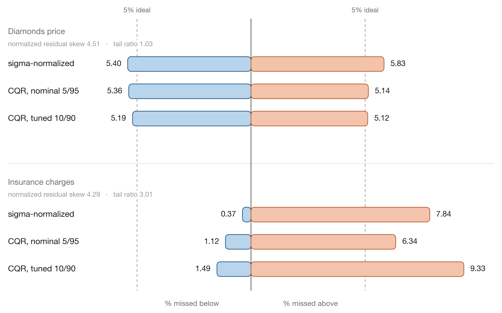
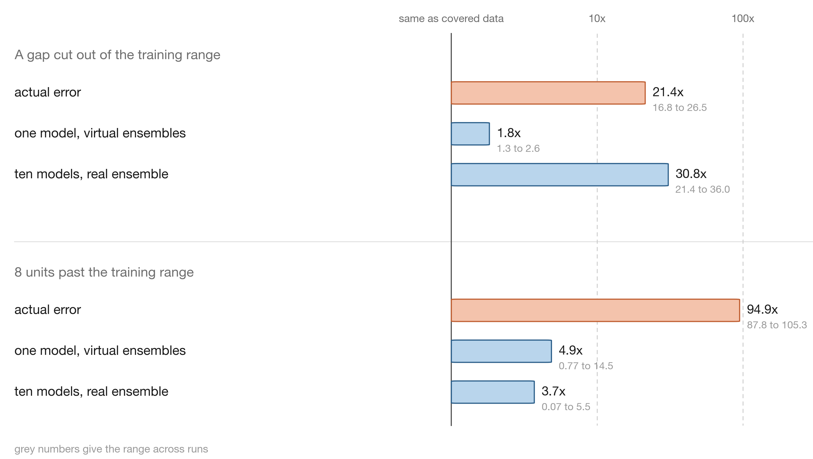
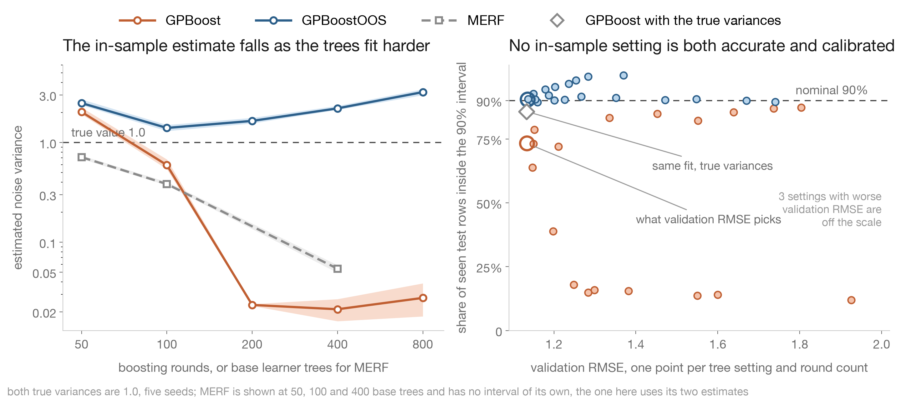
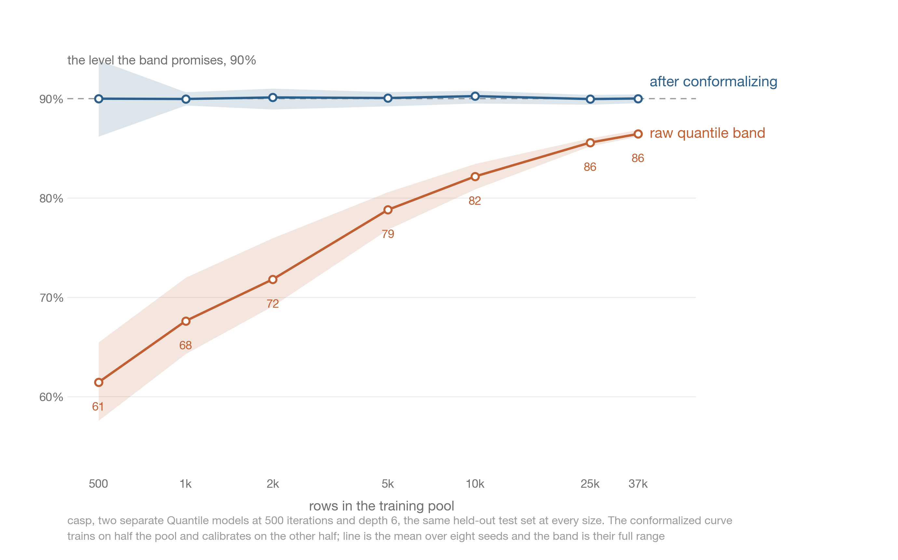
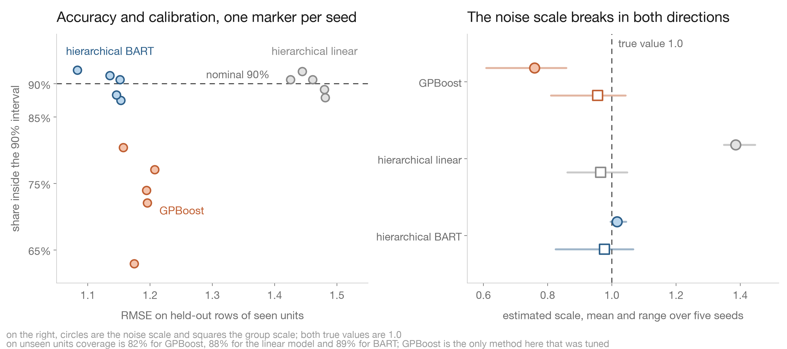
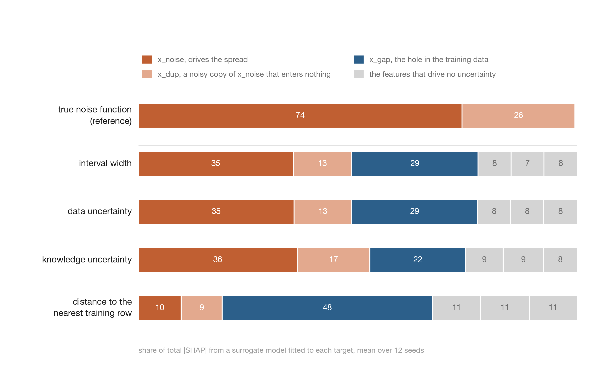
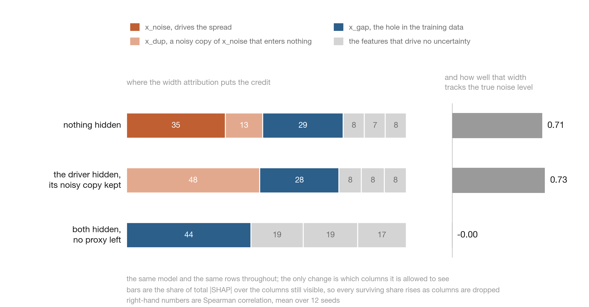

# demo-notebooks

Self-contained notebooks backing posts and articles. One notebook per topic, each pulling its data
from public URLs and runnable end to end in Colab.

| Notebook | Topic | Colab |
|---|---|---|
| [catboost_rmsewithuncertainty_conformal](notebooks/catboost_rmsewithuncertainty_conformal.ipynb) | Turning the CatBoost `RMSEWithUncertainty` sigma into a calibrated 90% interval, and which held-out diagnostic predicts a lopsided one | [open](https://colab.research.google.com/github/firefly1248/demo-notebooks/blob/main/notebooks/catboost_rmsewithuncertainty_conformal.ipynb) |
| [catboost_sglb_knowledge_uncertainty](notebooks/catboost_sglb_knowledge_uncertainty.ipynb) | Checking CatBoost's SGLB knowledge uncertainty against the actual error on a known function | [open](https://colab.research.google.com/github/firefly1248/demo-notebooks/blob/main/notebooks/catboost_sglb_knowledge_uncertainty.ipynb) |
| [panel_merf_gpboost_variance](notebooks/panel_merf_gpboost_variance.ipynb) | Where MERF and GPBoost get their noise variance from, and what their 90% interval actually covers | [open](https://colab.research.google.com/github/firefly1248/demo-notebooks/blob/main/notebooks/panel_merf_gpboost_variance.ipynb) |
| [catboost_quantile_multiquantile_cqr](notebooks/catboost_quantile_multiquantile_cqr.ipynb) | What a CatBoost quantile band actually covers, when `MultiQuantile` is enough and when it needs conformalizing | [open](https://colab.research.google.com/github/firefly1248/demo-notebooks/blob/main/notebooks/catboost_quantile_multiquantile_cqr.ipynb) |
| [uncertainty_attribution_shap](notebooks/uncertainty_attribution_shap.ipynb) | Whether attributing a prediction interval's width with SHAP recovers the features that actually drive the uncertainty | [open](https://colab.research.google.com/github/firefly1248/demo-notebooks/blob/main/notebooks/uncertainty_attribution_shap.ipynb) |
| [panel_pymc_hierarchical](notebooks/panel_pymc_hierarchical.ipynb) | Where a hierarchical Bayesian model gets its noise scale from, and why 90% coverage does not settle it | [open](https://colab.research.google.com/github/firefly1248/demo-notebooks/blob/main/notebooks/panel_pymc_hierarchical.ipynb) |
| [panel_irregular_kernel](notebooks/panel_irregular_kernel.ipynb) | Replacing a random intercept with a continuous time kernel on an irregular panel, and why the interval needs a horizon term | [open](https://colab.research.google.com/github/firefly1248/demo-notebooks/blob/main/notebooks/panel_irregular_kernel.ipynb) |

## catboost_rmsewithuncertainty_conformal

Builds a 90% interval from the `RMSEWithUncertainty` head three ways (raw, sigma-normalized
conformal, CQR at nominal 5/95 and 10/90) on one synthetic and two public datasets, measuring
coverage, width and where the misses land.

It also tests which held-out diagnostic predicts a lopsided interval. Skewness of the normalized
residuals does not: on diamonds it ranges 0.38 to 5.58 across four hyperparameter settings while
the miss imbalance stays between 0.4 and 0.8 points. Bowley skew and the ratio of the 5th and 95th
percentiles do.

About five minutes on a free Colab CPU.

## catboost_sglb_knowledge_uncertainty

`posterior_sampling=True` plus `virtual_ensembles_predict` reports knowledge uncertainty from a
single model. This notebook measures that signal against the truth: the data comes from a known and
bounded 2D function, so every test point has both a reported uncertainty and a real error, and no
region is intrinsically harder to predict than another.

Both uncertainty columns are variances, so the notebook square-roots them before comparing them
with an error in the units of the target. In a gap cut out of the training data the model is 8.2x
more wrong than on covered data while the reported uncertainty is 1.1x. Past the edge of the range
the error is 20x, the signal is one constant across all 800 test points, and the total uncertainty
comes to 0.66x, below the covered level on all ten runs. A nearest-neighbour distance to the
training set ranks the error at 0.78 against 0.00 for knowledge uncertainty.

About a minute on a free Colab CPU.

## panel_merf_gpboost_variance

MERF and GPBoost both fit a nonlinear fixed part with trees and a random intercept per unit, and
both return a variance decomposition. Both also estimate the noise variance from residuals on rows
the fixed part was trained on, so the number tracks how hard the trees are fitted. On a synthetic
panel where the group variance and the noise variance are both 1.0, the group variance comes back
at 0.92 while the noise variance reads 0.58 for GPBoost at the setting a validation split picks,
and 0.71, 0.38 and 0.054 for MERF at 50, 100 and 400 base learner trees.

GPBoost's own 90% interval inherits that, covering 73% of held-out rows on seen units. Across the
20 settings in the tuning grid its coverage runs from 7% to 87%, and the 87% comes from underfitted
settings that the validation split rejects. Algorithm 2 of Sigrist (2022), which estimates the covariance parameters
from held-out residuals, brings coverage to 90% at the same accuracy.

About half an hour on a laptop CPU.

## catboost_quantile_multiquantile_cqr

The same 90% band built three ways — two separate `Quantile` models, `MultiQuantile` on the outer
pair, and `MultiQuantile` on ten levels — across the three datasets from the conformalized quantile
regression paper, at three hyperparameter settings and eight seeds.

None of the 27 seed-averaged raw bands reached the level it claimed; they run from 55.6% to 89.8%,
and how hard the trees are fitted moves coverage more than which of the three arms produced the
band. Conformalizing centres every dataset on 90% and holds there across a training sweep where the
raw band climbs from 61% at a 500-row pool to 86% at 36,584.

Asking one model for ten levels ran about 3x faster than fitting ten and crossed far less often, on
4% to 74% of rows against 24% to 97%. It is still not the best answer to crossing: sorting each row
of predictions removes crossings outright and lands the individual levels closer in all nine
settings.

About fifteen minutes on a laptop CPU.

## panel_pymc_hierarchical

The panel from `panel_merf_gpboost_variance`, with the same known scales, fitted as a hierarchical
Bayesian model instead. The posterior predictive integrates over the parameters, so its interval
carries the error of the fitted mean, which is the term the tree methods there had no room for.

Both PyMC models cover 90.0% of held-out rows on seen units against GPBoost's 73%, and only one of
them recovers the noise scale. A linear mean cannot fit a nonlinear truth, so its residual scale
reads 1.39 against a true 1.0 and the interval widens to match. `pymc_bart.BART` in the mean slot
reads 1.00 to 1.04 over five seeds and beats the tuned GPBoost on accuracy at the same time, at 15
seconds a fit against 37 for GPBoost's whole 20-setting grid.

It also measures what a zeroed intercept costs on an unseen unit, what a frozen BART node returns
after `pm.set_data`, and which of the two standard hierarchical precautions matter on this panel.

About five minutes on a laptop CPU.

## uncertainty_attribution_shap

There is no library for asking which features make a row uncertain, so the common recipe is to take
the interval width as a target, fit a second model to it and read that model's SHAP values. This
notebook runs that recipe on data where the answer is known in advance: six features, one job each,
with the noise scale driven by one of them and a slice of another's range cut out of the training
data.

The recipe does rank the two real sources above the three features that drive no uncertainty, 35%
and 29% against about 8% each. It does not separate them. The interval width is dominated by the
data variance, which runs about 740x the knowledge variance here, so attributing the width
attributes the noise; reading the knowledge column instead gives the hole feature less credit than
the width already gave it. Attributing the true noise function, where the correct answer is not in
doubt, still sends a quarter of the credit to a copy correlated 0.985 with the real driver.

Distance to the nearest training row puts the hole feature first on all twelve seeds, at 48%
against about 10% for everything else.

Two interventions follow. Putting rows back into the hole cuts the error there by a factor of eight,
three quarters of it from the first 5% of rows, but the interval width falls and then drifts back up
to slightly above the width outside — the excess from thin coverage goes away and a floor remains.

Withholding columns turns the same design into the case where the driver of the spread was never
recorded. Hide it and leave its correlated copy, and the copy takes 48% of the credit where
renormalisation alone would give 20.5%, a confident answer naming a feature that causes nothing.
Hide both and the width goes on varying and the surrogate goes on ranking, while the correlation
between that width and the true noise level falls from 0.71 to zero.

About three minutes on a laptop CPU.
